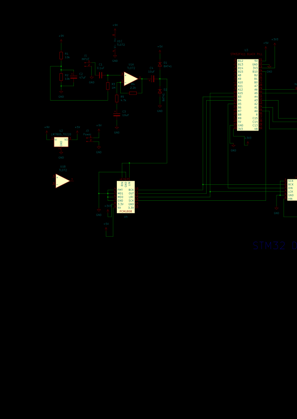

# STM32 Digital reverb

This repository contains all the code needed to use **STM32F411** as a reverberation unit, as well as hardware connection schematic. This unit recreate Hall and Plate reverb algorithms as well as Shimmer that can be added to both of them. 

This README contains hardware description and instruction on how to connect everything and some notes about problems I've encountered. That process was long and agonizing, so I hope I can make your life a bit easier. 

The main components are:
- STM32F411 MCU
- PCM1808 ADC
- PCM5102 DAC
- TL072 OP-Amp
- L7805 voltage regulator
- a bunch of resistors and capacitors

## Power
The main power source is a center negative 9V DC PSU as in most guitara pedals. STM32, ADC and DAC require 5V/3.3V or both, to power everything we use L7805 voltage regulator that outputs 5V. 5V go into STM32 and it's internal regulator is powering the MCU with 3.3V as well as outputting this vooltage to 3V3 pins. We use this pins as source for 3.3V power line.

## Input stage

The project is aimed to create a guitar pedal, so it follows some of the common practices of making such pedal. This stage is optional, but is highly recomended.

The input stage is basically a buffer and an amp. The stage's role is to match imedances and amplify the signal a little. In the heart of the input stage is **TL072** OP-Amp. The stage parts are:
- AC coupling
- Amplification
- Clipping

### Virual ground

By putting two resistors with same values to ground and 9V we create reference point at **9V/2 = 4.5V**. We use this reference point to _shift_ input signal so it will be alternating relative to the 4.5V point and not 0V. This way OP-Amp will amplify signal _both_ ways. We achieve this by putting 1M resistor from the input signal to the virtual ground.

### Amplification

Again, this project created with guitar in mind and average guitar signal is usually less than 1V in range with hot active pickups reaching up to 2V in some cases. The PCM1808 as well as other digital components in this project works within 3.3V logic, so we can amplify the input signal a little to achieve more headroom. We achieve this by putting two resistors and a capacitor in the negative feedback loop of the OP-Amp as in schematic. Gain coeficient _(Vin/Vout)_ is calculated using this formula:

_Gain = 1 + Rf/Rin_

Where _Rf_ is a feedback resistor and _Rin_ is a ground resistor. Using our values we get a ~1.47 gain coeficient. That means even if the signal's range is 2V we get ~3V range before ADC.

We use one more capacitor after the op-amp to bring the signal's reference point back to the 0V.

### Clipping

We need to be safe in case of extreme high voltages that can fry the ADC. It is achieved by clipping signal with voltage higher that 3.3V using diodes as in schematic.

## Peripherals

### ADC

This project uses PCM1808 ADC. It is 24-bit and can work with up to 96 kHz sample rate. The CD standart is 16-bit and 44.1 kHz, but newer audio devices mostly use 24-bit 48 kHz standart, which we will be using also. 

PCM1808 works via I2S protocol that is based on SPI. It usually uses 4 main lines:
- BCK (Bit Clock) - synchronizes every bit of data.
- WS (Word Select) - channel select: 0 - left, 1 - right
- SD (Serial Data) - main data line that carries signal
- MSCK (Master Clock) - not usually needed, but often used to synchronize internal operations of the converter

We connect them all to standart I2S pins on STM32. Also we connect amplified signal both to left and right inputs, because the signal is mono.

FMT(on some boards FMY), MD1(MDI) and MD0 are all connected to ground ensure proper settings.

### DAC

We use PCM5102 DAC. It supports up to 32-bit, 384 kHz standart that covers all our needs. It works the same way as ADC just backwards :). The main difference is in Master Clock, it is optional in this module, so we won't be using it. BCK and WS are connected to the same way as the corresponing pins on the ADC. 

> **NOTE:** There are pads on the back side that need to be soldered manually to set up the module. In my case I needed to solder pads 1,2 and 4 to L and pad 3 to H, but it can be different for other boards. The FMT, FLT and DEMP pins should be connected to the ground and XSMT should be connected to the 3.3V. Use multimeter in continuity mode to check connection between pads and pins.

## STM32

The MCU was configured in STM32 CubeMX and you can view all the settings in the .ioc file. Some important parts are:

- **Clock:** Make sure to set up PLLI2S. Coeficients were defined by tweaking them until the error was the smallest possible. You can see error in Multimedia->I2S3->Parameter settings
- **DMA:** Set DMA buffers to circular and using half-word.
- **Switches** The shimmer switch is set to activate shimmer on LOW, because for some reason I get audio artifacts activating it on HIGH. Idk if it's a code of hardware problem